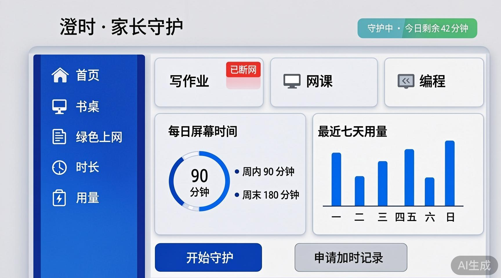
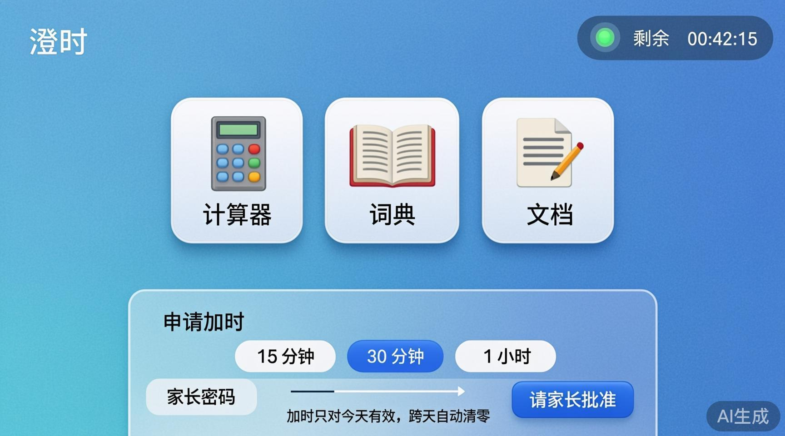
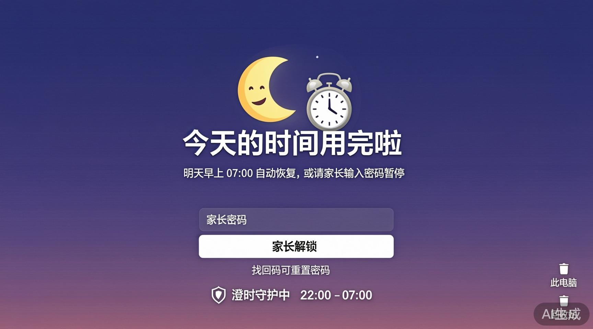

# 澄时（Chengshi）

给孩子的 Windows 屏幕时间守护：家长设好「允许的软件」和「每天时长」后，孩子只能打开名单里的软件；时间用完就只剩系统桌面。整个流程用家长密码保护，密码忘了用找回码重置。

## 功能

- **三种书桌模板**：写作业（文档 + 词典 + 计算器，**断网**）、网课（浏览器 + 笔记）、编程（IDE + 终端），软件名单可自定义，也可以从本机已装软件里勾选或直接挑 exe。
- **绿色上网**（每张书桌可配）：
  - **允许的网站**（白名单模式）：填了之后，浏览器只能打开名单里的网站；
  - **禁止类别**：短视频/直播、游戏、成人内容三类预置名单，可整类勾选或取消；
  - **禁止的网站**：自定义黑名单域名。
  - 通过 Chrome / Edge 的企业策略（URLBlocklist / URLAllowlist 注册表）按会话注入，守护结束自动清除，不残留。
- **睡觉时段**：22:00–07:00 默认断网（守护期间生效），帮助孩子按时睡觉。
- **每天屏幕时间**：周内 / 周末分开限额，也可以给某几天自定义分钟数（5–600）。用时基于系统单调时钟（QueryUnbiasedInterruptTime），改系统时间骗不了它；跨天自动重置。
- **申请加时**：时间用完后孩子可以点「申请加时」，家长当场选 15 分钟 / 30 分钟 / 1 小时、输家长密码批准。加时只对今天有效，跨天自动清零；正在书桌里时也可以随时加。
- **最近七天用量**：跨天时把当天用了多久、拦了几次写进本机日志（`usagelog.jsonl`），家长仪表盘用小条形图画出来。
- **设置改不了**：改时长、书桌软件、开始守护都要先输家长密码——界面程序要验一次，守护服务的管道也会再核一遍（每条连接单独解锁），孩子自己的进程冒充界面发消息同样被拒。
- **拦截**：ETW 内核进程创建事件 + 800ms 轮询双保险；只拦当前交互会话，不碰系统服务和其他登录用户。名单外的进程连同子进程一起结束，名单基于文件名 + 完整路径。
- **时间用完**：进入「时间用完」桌面，只留系统本身；明天自动恢复，或输入家长密码暂停。
- **断网**（写作业书桌）：通过 Windows 防火墙出站规则挡住网络出口；会话结束自动解除。
- **找回码**：设置时生成、忘了密码用它重置；预留备用邮箱（配置 SMTP）后也可以走邮箱验证码重置——发码与校验都在守护服务端完成，验证码不会经过界面进程。澄时不碰你的密码明文，只存 PBKDF2 哈希；找回码也只在首次设置和重置时展示一次。密码验证连错 5 次会锁定，防止穷举。

## 界面

| 家长仪表盘 | 孩子书桌 | 时间用完锁屏 |
|---|---|---|
|  |  |  |

- **家长仪表盘**：挑书桌、设时长，点「开始守护」；今天还剩多少、最近七天用了多少，一眼可见。
- **孩子书桌**：桌面上只有允许的软件和大大的倒计时；时间不够可以申请加时，家长选个时长、输密码当场批准。
- **时间用完**：进入夜晚锁屏，明天早上自动恢复；家长可以加时，或输密码提前解锁。

## 架构

```
Chengshi.App       WPF 界面（普通权限，托盘常驻）
    │  命名管道 "Chengshi"（JSON 帧协议，见 src/Chengshi.Ipc；
    │  改配置类请求按连接验证家长密码后才放行）
    ▼
Chengshi.Service   Windows 服务「澄时守护服务」（SYSTEM，延迟自启 + 崩溃自动重启）
    │  SessionHost：状态机 + 进程拦截 + 断网/睡觉时段 + 浏览器策略 + 开机守护
    ▼
%ProgramData%\Chengshi\*.json   共享配置（desks / family / screentime）
    Users 只读，写仅限管理员/SYSTEM——孩子账号改不了配置文件
```

- 界面启动时**优先连服务**（服务才是权威守护者：管理员权限、孩子杀不掉）；连不上就回退成本机守护，界面提示哪些能力缺了。本机回退模式若对数据目录没有写权限（未提权），设置会进入只读展示并在提示里说明。
- 服务启动时如果「开机守护」开着，自动开始守护——孩子重启电脑也逃不掉。
- 配置文件只由服务写；老安装如果曾把数据目录开成了 Users 可写，升级后的服务第一次启动会自动把权限收紧为「Users 只读」。
- 数据目录可被环境变量 `CHENGSHI_DATA_DIR` 覆盖（测试/便携用）。

## 安装（目标机器上）

1. `scripts\publish.ps1` — 跑测试并发布两个自包含单文件 exe 到 `artifacts\publish\`。
2. 右键「以管理员身份运行」`scripts\install.ps1`（自带发布，可加 `-SkipPublish` 跳过）：
   - 安装到 `%ProgramFiles%\Chengshi`；
   - 注册并启动 Windows 服务 `Chengshi`（延迟自启，崩溃自动重启）；
   - 建 `%ProgramData%\Chengshi` 并给 Users 修改权；
   - 建开始菜单快捷方式。
3. 从开始菜单打开「澄时」，设家长密码（顺手抄下找回码）、挑软件、选时长，点「开始守护」。开机自启由澄时第一次设置后自行登记。安装后可以在 Windows「设置 → 应用」里直接卸载。
4. **重要**：请给孩子使用「标准用户」账号。孩子若是管理员账号（或知道管理员密码），可以卸载服务绕开守护——这是 Windows 权限模型的边界。

> 老版本（开发期）的配置放在 `%LOCALAPPDATA%\Chengshi`，新版本启动时会把缺的配置文件自动补齐到 `%ProgramData%\Chengshi`，家长密码和书桌设置不丢。

卸载：管理员运行 `scripts\uninstall.ps1`（默认保留配置，加 `-RemoveData` 连密码一起删）。

## 开发

```powershell
scripts\run-spike.ps1            # 构建并跑 App（本地守护模式，无需服务）
dotnet test Chengshi.slnx        # 全部测试（Core 73 + Engine 70，含安全回归）
dotnet run --project tools\Probe # 诊断：服务在不在、配置是什么
scripts\package.ps1              # 打包：产出 dist\ChengshiSetup.exe（双击即装）与分发 zip
```

- 环境：.NET SDK 10.0.400（`global.json`），目标 `net10.0-windows`，语言 zh-CN。
- 服务可以直接当控制台跑（没被 SCM 启动时），方便调试日志。
- 界面与服务的日志写在数据目录 `logs\*.log`（超限自动轮换），现场排障先看这里。
- 「试一下拦截」按钮会开一个只留计算器的 1 分钟尖刺场次，用来确认拦截生效。

## 测试

- `tests/Chengshi.Core.Tests`：预算、周内/周末限额、状态机（含加时延期）、密码、匹配规则、系统进程放行边界。
- `tests/Chengshi.Engine.Tests`：IPC 消息往返、管道端到端（守护/停止/改配置/推送/批加时，含「没验密码不许改」的门禁）、周内/周末限额按日历切换、加时的额度记账一致性、跨天用量日志、进程拦截的会话限定（不误杀服务与其他用户）、磁盘配置热刷新，以及安全底线回归（哈希/找回码不出服务、密码锁定、万能口令已移除、邮箱找回服务端校验、SMTP 加密落盘）。

## 目录

```
src/Chengshi.Core     领域模型：书桌、白名单、状态机、密码、预算
src/Chengshi.Engine   SessionHost、进程拦截、断网、存储、用量日志、管道服务端/客户端
src/Chengshi.Ipc      命名管道协议与消息帧
src/Chengshi.Service  Windows 服务宿主
src/Chengshi.App      WPF 界面 + 托盘
tests/                xunit 测试
scripts/              发布/安装/卸载/开发脚本
tools/Probe           服务诊断工具
```

## 已知边界

- 断网是整机出站规则（家庭单机场景）；多用户各自账号的场景下，写作业书桌会断掉所有人的网。
- 绿色上网通过 Chrome/Edge 策略生效：**只覆盖这两个浏览器**；Firefox 及其他内置浏览器的软件要么在白名单外被关掉，要么不受网站规则约束。预置禁止名单是人工维护的头部站点清单，不是全量数据库。
- 拦截针对「当前交互会话」：孩子如果开另一个 Windows 账号，那个会话不受守护（这是保护其他用户的设计）。
- 名单外的浏览器扩展、浏览器内的网站级别限制不在范围内——浏览器要么在名单里，要么整个被关掉。
- 管道门禁与配置只读防的是**没有管理员权限的孩子进程**；如果孩子的 Windows 账号本身就是管理员（或会进安全模式），这些防线会被绕过——安装时请给孩子建标准用户账号（引导页也会提醒）。
- 没装守护服务的本机回退模式只是备用：孩子可以直接结束界面进程，改配置也不走密码门禁。真正的守护以服务模式为准。
- 邮箱找回密码需要家长先配置 SMTP（QQ/163/新浪预设）；没配置时该功能不可用，找回码是唯一重置凭证。
- 时间到之后的解锁宽限期只在服务端验证家长密码成功后开启；家长解锁 Windows 后需在界面里验证一次密码（或直接加时/结束守护），否则最多 45 秒后会重新锁屏。
